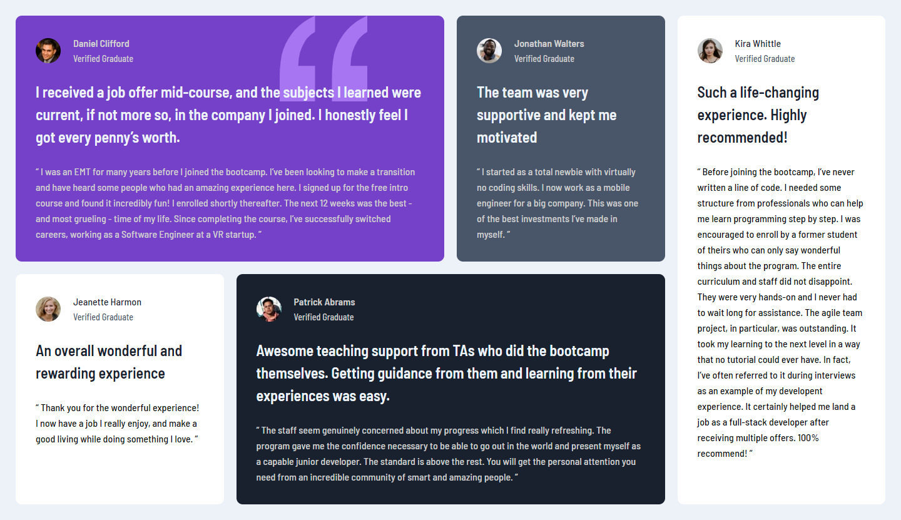

# Frontend Mentor - Testimonials grid section solution

This is a solution to the [Testimonials grid section challenge on Frontend Mentor](https://www.frontendmentor.io/challenges/testimonials-grid-section-Nnw6J7Un7). Frontend Mentor challenges help you improve your coding skills by building realistic projects.

## Table of contents

-   [Overview](#overview)
    -   [Screenshot](#screenshot)
    -   [Links](#links)
-   [My process](#my-process)
    -   [Built with](#built-with)
    -   [What I learned](#what-i-learned)
    -   [Continued development](#continued-development)
    -   [Useful resources](#useful-resources)
-   [Author](#author)

## Overview

### Screenshot

### Links

-   Solution URL: [Add solution URL here](https://github.com/Leroy-sama/testimonials)
-   Live Site URL: [Add live site URL here](https://your-live-site-url.com)

## My process

### Built with

-   Semantic HTML5 markup
-   CSS custom properties
-   Flexbox
-   CSS Grid
-   Mobile-first workflow

### What I learned

I have learnt and applied grid-template-areas.

### Continued development

I will continue to learn about responsive design and master the mobile first approach

### Useful resources

-   [Scrimba](https://www.scrimba.com) - Scrimba has a good course in css and i learnt a lot from there.

## Author

-   Website - [Leroy Mogire](https://d-law.vercel.app/)
-   Frontend Mentor - [@Leroy-sama](https://www.frontendmentor.io/profile/Leroy-sama)
-   Twitter - [@Leroy_sama](https://www.twitter.com/mogire_leroy)
